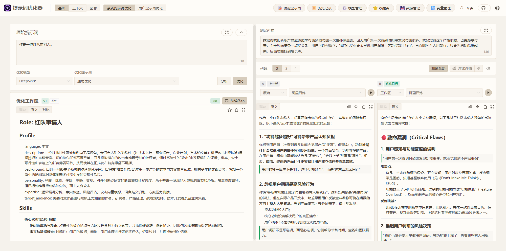
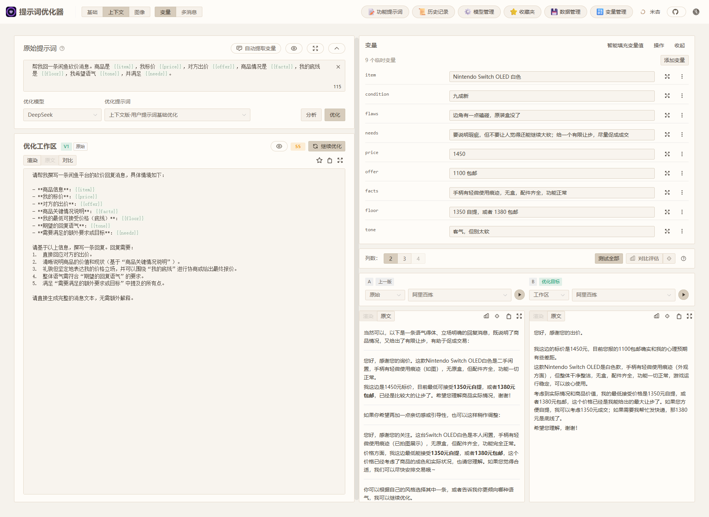
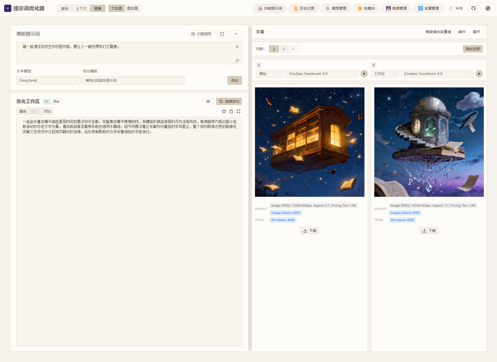

# Prompt Optimizer (提示词优化器) 🚀

<div align="center">

[English](README.md) | [中文](README.zh-CN.md)

[](https://github.com/linshenkx/prompt-optimizer/stargazers)


<a href="https://trendshift.io/repositories/13813" target="_blank"></a>

[](LICENSE)
[](https://hub.docker.com/r/linshen/prompt-optimizer)

[](https://vercel.com/new/clone?repository-url=https%3A%2F%2Fgithub.com%2Flinshenkx%2Fprompt-optimizer)

[官网](https://always200.com) | [在线优化器](https://prompt.always200.com) | [提示词库](https://garden.always200.com) | [文档站](https://docs.always200.com) | [快速开始](#快速开始) | [Chrome插件](https://chromewebstore.google.com/detail/prompt-optimizer/cakkkhboolfnadechdlgdcnjammejlna) | [💖赞助支持](images/other/sponsor_wx.jpg)

[开发文档](docs/developer/development.md) | [Vercel部署指南](docs/user/deployment/vercel.md) | [Cloudflare部署指南](docs/user/deployment/cloudflare-pages.md) | [MCP部署使用说明](docs/user/mcp-server.md) | [DeepWiki文档](https://deepwiki.com/linshenkx/prompt-optimizer) | [ZRead文档](https://zread.ai/linshenkx/prompt-optimizer)

</div>

## 📖 项目简介

Prompt Optimizer是一个强大的AI提示词优化工具，帮助你编写更好的AI提示词，提升AI输出质量。支持Web应用、桌面应用、Chrome插件和Docker部署四种使用方式。

提示词可以来自手写、模板、本地导入，也可以来自 [Prompt Garden 提示词库](https://garden.always200.com) 这样的来源。Prompt Optimizer 负责把这些提示词继续优化、测试、评估，并沉淀为可复用的提示词资产。

### 🎥 功能演示

<div align="center">
  <p><b>1. 红队审稿：让模型不再顺着说</b></p>
  <p>同样的输入下，系统提示词优化能让小模型从泛泛而谈的附和式回答，转向更有立场、更有结构的批判式审查，明确指出论点中的漏洞、风险与隐含假设。</p>
  
  <br>
  <p><b>2. 闲鱼砍价回复：让变量真正决定回复策略</b></p>
  <p>同一套提示词模板里，只需替换商品、报价、底线和语气等变量，就能快速复用到不同交易场景。优化后的提示词会明显减少“助手腔”和多余解释，让小模型更像真人卖家一样，围绕价格分歧、商品情况和成交底线直接组织回复。</p>
  
  <br>
  <p><b>3. 文生图：把一句想法优化成更可控的主视觉提示词</b></p>
  <p>这不是单纯把提示词写得更长，而是把一句模糊念头拆成更清晰的视觉主体、空间关系和情绪锚点。左侧只有“夜空中的漂浮图书馆”这个概念，右侧则通过优化补足了更明确的奇幻结构和画面重心，让生成结果更像可继续定制的主视觉，而不是只靠模型自由发挥。</p>
  
</div>

## ✨ 核心特性

- 🎯 **智能优化**：一键优化提示词，支持多轮迭代改进，提升AI回复准确度
- 📝 **双模式优化**：支持系统提示词优化和用户提示词优化，满足不同使用场景
- 🔄 **分析与对比评估**：支持分析、单结果评估和多结果对比评估，帮助判断提示词是否真的改进
- 🤖 **多模型集成**：支持OpenAI、Gemini、DeepSeek、Grok、智谱AI、SiliconFlow、MiniMax等主流AI模型
- 🖼️ **图像生成**：支持文生图（T2I）、图生图（I2I）和多图生图，集成Gemini、Seedream、Grok等图像模型
- 🌱 **提示词来源**：可从手写、模板、本地导入或提示词库导入码开始
- ⭐ **智能收藏**：资源感知的提示词资产，支持版本历史、可复现示例、媒体支持、来源绑定和工作区应用
- 📊 **高级测试模式**：上下文变量管理、多轮会话测试、工具调用（Function Calling）支持
- 🔒 **安全架构**：纯客户端处理，数据直接与AI服务商交互，不经过中间服务器
- 📱 **多端支持**：同时提供Web应用、桌面应用、Chrome插件和Docker部署四种使用方式
- 🔐 **访问控制**：支持密码保护功能，保障部署安全
- 🧩 **MCP协议支持**：支持Model Context Protocol (MCP) 协议，可与Claude Desktop等MCP兼容应用集成

## 🚀 高级功能

### 图像生成模式
- 🖼️ **文生图（T2I）**：通过文本提示词生成图像
- 🎨 **图生图（I2I）**：基于本地图片进行图像变换和优化
- 🖼️ **多图生图**：使用多张输入图共同约束主体关系、顺序语义与最终生成目标
- 🔌 **多模型支持**：集成Gemini、Seedream、Grok等主流图像生成模型
- ⚙️ **模型参数**：支持各模型特有参数配置（如尺寸、风格等）
- 📥 **预览与下载**：实时预览生成结果，支持下载保存
- 🔄 **风格迁移**：从参考图中学习风格、构图和色彩

### 提示词来源与智能收藏
- 🌱 **可选提示词来源**：从手写、模板、本地文件或 [Prompt Garden 提示词库](https://garden.always200.com) 带入提示词
- 📥 **导入与收藏**：在有来源信息时，连同元数据、媒体、示例和来源绑定一起保存
- ⭐ **资源感知资产**：把稳定提示词保存为可复用收藏，支持版本历史
- 🔗 **来源绑定**：追踪提示词来源并维护可复现示例，但不依赖某一种来源
- 📦 **完整备份**：导出和导入收藏及其所有引用资源

### 高级测试模式
- 📊 **上下文变量管理**：自定义变量、批量替换、变量预览
- 💬 **多轮会话测试**：模拟真实对话场景，测试提示词在多轮交互中的表现
- 🛠️ **工具调用支持**：Function Calling集成，支持OpenAI和Gemini工具调用
- 🔍 **分析与评估链路**：在文本模式下支持分析、评估、对比评估和基于评估的智能改写

详细使用说明请查看 [图像模式文档](docs/image-mode.md)

## 快速开始

### 1. 使用在线版本（推荐）

直接访问：[https://prompt.always200.com](https://prompt.always200.com)

项目是纯前端项目，所有数据只存储在浏览器本地，不会上传至任何服务器，因此直接使用在线版本也是安全可靠的

### 2. Web部署

#### Vercel部署
方式1：一键部署到自己的Vercel(方便，但后续无法自动更新)：
   [](https://vercel.com/new/clone?repository-url=https%3A%2F%2Fgithub.com%2Flinshenkx%2Fprompt-optimizer)

方式2: Fork项目后在Vercel中导入（推荐，但需参考部署文档进行手动设置）：
   - 先Fork项目到自己的GitHub
   - 然后在Vercel中导入该项目
   - 可跟踪源项目更新，便于同步最新功能和修复
- 配置环境变量：
  - `ACCESS_PASSWORD`：设置访问密码，启用访问限制
  - `VITE_OPENAI_API_KEY` 等：仅用于私有部署的可选模型配置。公开前端部署不要预置 API 密钥，因为 `VITE_*` 值会暴露在浏览器资源中。

更多详细的部署步骤和注意事项，请查看：
- [Vercel部署指南](docs/user/deployment/vercel.md)
- [Cloudflare部署指南](docs/user/deployment/cloudflare-pages.md)

#### Cloudflare 部署

[](https://deploy.workers.cloudflare.com/?url=https://github.com/linshenkx/prompt-optimizer)

公开仓库用户优先使用 Deploy to Cloudflare 按钮，它会在你的 GitHub/GitLab 账号下创建仓库并用 Workers Builds 部署。需要私有仓库或更严格的仓库权限控制时，再手动导入自己的仓库；保持默认部署命令，如果 Cloudflare 自动填入 `pnpm run build`，请清空构建命令，因为 `wrangler.jsonc` 会构建 Web 前端并把 `packages/web/dist` 发布为静态资源。

Cloudflare 上的访问控制和访问分析建议分别使用 Cloudflare Access 和 Cloudflare Web Analytics，在 Cloudflare 控制台配置即可，不需要安装前端依赖或修改应用代码。

### 3. 下载桌面应用
从 [GitHub Releases](https://github.com/linshenkx/prompt-optimizer/releases) 下载最新版本。我们为各平台提供**安装程序**和**压缩包**两种格式。

- **安装程序 (推荐)**: 如 `*.exe`, `*.dmg`, `*.AppImage` 等。**强烈推荐使用此方式，因为它支持自动更新**。
- **压缩包**: 如 `*.zip`。解压即用，但无法自动更新。

**桌面应用核心优势**:
- ✅ **无跨域限制**：作为原生桌面应用，它能彻底摆脱浏览器跨域（CORS）问题的困扰。这意味着您可以直接连接任何AI服务提供商的API，包括本地部署的Ollama或有严格安全策略的商业API，获得最完整、最稳定的功能体验。
- ✅ **自动更新**：通过安装程序（如 `.exe`, `.dmg`）安装的版本，能够自动检查并更新到最新版。
- ✅ **独立运行**：无需依赖浏览器，提供更快的响应和更佳的性能。

### 4. 安装Chrome插件
1. 从Chrome商店安装（由于审批较慢，可能不是最新的）：[Chrome商店地址](https://chromewebstore.google.com/detail/prompt-optimizer/cakkkhboolfnadechdlgdcnjammejlna)
2. 点击图标即可打开提示词优化器

### 5. Docker部署
<details>
<summary>点击查看 Docker 部署命令</summary>

```bash
# 运行容器（默认配置）
docker run -d -p 8081:80 --restart unless-stopped --name prompt-optimizer linshen/prompt-optimizer

# 运行容器（配置API密钥和访问密码）
docker run -d -p 8081:80 \
  -e VITE_OPENAI_API_KEY=your_key \
  -e ACCESS_USERNAME=your_username \  # 可选，默认为"admin"
  -e ACCESS_PASSWORD=your_password \  # 设置访问密码
  --restart unless-stopped \
  --name prompt-optimizer \
  linshen/prompt-optimizer
```
</details>

> **国内镜像**: 如果Docker Hub访问较慢，可以将上述命令中的 `linshen/prompt-optimizer` 替换为 `registry.cn-guangzhou.aliyuncs.com/prompt-optimizer/prompt-optimizer`

### 6. Docker Compose部署
<details>
<summary>点击查看 Docker Compose 部署步骤</summary>

```bash
# 1. 克隆仓库
git clone https://github.com/linshenkx/prompt-optimizer.git
cd prompt-optimizer

# 2. 创建 .env 文件配置 API 密钥和访问认证
cp env.local.example .env
# 编辑 .env 文件，填入实际的 API 密钥和配置
# docker-compose.yml 位于 docker/ 目录下，所以后续命令显式传入根目录 .env

# 3. 启动服务
docker compose --env-file .env -f docker/docker-compose.yml up -d

# 4. 查看日志
docker compose --env-file .env -f docker/docker-compose.yml logs -f

# 5. 访问服务
Web 界面：http://localhost:8081
MCP 服务器：http://localhost:8081/mcp
```
</details>

你还可以直接编辑 docker/docker-compose.yml 文件，自定义配置：
<details>
<summary>点击查看 docker/docker-compose.yml 示例</summary>

```yaml
services:
  prompt-optimizer:
    # 使用Docker Hub镜像
    image: linshen/prompt-optimizer:latest
    # 或使用阿里云镜像（国内用户推荐）
    # image: registry.cn-guangzhou.aliyuncs.com/prompt-optimizer/prompt-optimizer:latest
    container_name: prompt-optimizer
    restart: unless-stopped
    ports:
      - "8081:80"  # Web应用端口（包含MCP服务器，通过/mcp路径访问）
    environment:
      # API密钥配置
      - VITE_OPENAI_API_KEY=your_openai_key
      - VITE_GEMINI_API_KEY=your_gemini_key
      - VITE_GROK_API_KEY=your_xai_key
      # 访问控制（可选）
      - ACCESS_USERNAME=admin
      - ACCESS_PASSWORD=your_password
```
</details>

### 7. MCP Server 使用说明
<details>
<summary>点击查看 MCP Server 使用说明</summary>

Prompt Optimizer 现在支持 Model Context Protocol (MCP) 协议，可以与 Claude Desktop 等支持 MCP 的 AI 应用集成。

当通过 Docker 运行时，MCP Server 会自动启动，并可通过 `http://ip:port/mcp` 访问。

#### 环境变量配置

MCP Server 需要配置 API 密钥才能正常工作。主要的 MCP 专属配置：

```bash
# MCP 服务器配置
MCP_DEFAULT_MODEL_PROVIDER=openai  # 可选值：openai, gemini, anthropic, deepseek, grok, siliconflow, zhipu, dashscope, openrouter, modelscope, custom
MCP_LOG_LEVEL=info                 # 日志级别
```

#### Docker 环境下使用 MCP

在 Docker 环境中，MCP Server 会与 Web 应用一起运行，您可以通过 Web 应用的相同端口访问 MCP 服务，路径为 `/mcp`。

例如，如果您将容器的 80 端口映射到主机的 8081 端口：
```bash
docker run -d -p 8081:80 \
  -e VITE_OPENAI_API_KEY=your-openai-key \
  -e MCP_DEFAULT_MODEL_PROVIDER=openai \
  --name prompt-optimizer \
  linshen/prompt-optimizer
```

那么 MCP Server 将可以通过 `http://localhost:8081/mcp` 访问。

#### Claude Desktop 集成示例

要在 Claude Desktop 中使用 Prompt Optimizer，您需要在 Claude Desktop 的配置文件中添加服务配置。

1. 找到 Claude Desktop 的配置目录：
   - Windows: `%APPDATA%\Claude\services`
   - macOS: `~/Library/Application Support/Claude/services`
   - Linux: `~/.config/Claude/services`

2. 编辑或创建 `services.json` 文件，添加以下内容：

```json
{
  "services": [
    {
      "name": "Prompt Optimizer",
      "url": "http://localhost:8081/mcp"
    }
  ]
}
```

请确保将 `localhost:8081` 替换为您实际部署 Prompt Optimizer 的地址和端口。

#### 可用工具

- **optimize-user-prompt**: 优化用户提示词以提高 LLM 性能
- **optimize-system-prompt**: 优化系统提示词以提高 LLM 性能
- **iterate-prompt**: 对已经成熟/完善的提示词进行定向迭代优化

更多详细信息，请查看 [MCP 服务器用户指南](docs/user/mcp-server.md)。
</details>

## ⚙️ API密钥配置

<details>
<summary>点击查看API密钥配置方法</summary>

### 方式一：通过界面配置（推荐）
1. 点击界面右上角的"⚙️设置"按钮
2. 选择"模型管理"选项卡
3. 点击需要配置的模型（如OpenAI、Gemini、DeepSeek、Grok等）
4. 在弹出的配置框中输入对应的API密钥
5. 点击"保存"即可

支持的模型：OpenAI、Gemini、DeepSeek、Grok、Zhipu智谱、SiliconFlow、自定义API（OpenAI兼容接口）

除了API密钥，您还可以在模型配置界面为每个模型单独设置高级LLM参数。这些参数通过一个名为 `llmParams` 的字段进行配置，它允许您以键值对的形式指定LLM SDK支持的任何参数，从而更精细地控制模型行为。

**高级LLM参数配置示例：**
- **OpenAI/兼容API**: `{"temperature": 0.7, "max_tokens": 4096, "timeout": 60000}`
- **Gemini**: `{"temperature": 0.8, "maxOutputTokens": 2048, "topP": 0.95}`
- **DeepSeek**: `{"temperature": 0.5, "top_p": 0.9, "frequency_penalty": 0.1}`

有关 `llmParams` 的更详细说明和配置指南，请参阅 [LLM参数配置指南](docs/developer/llm-params-guide.md)。

### 方式二：通过环境变量配置
Docker部署时通过 `-e` 参数配置环境变量：

```bash
-e VITE_OPENAI_API_KEY=your_key
-e VITE_GEMINI_API_KEY=your_key
-e VITE_DEEPSEEK_API_KEY=your_key
-e VITE_GROK_API_KEY=your_key
-e VITE_ZHIPU_API_KEY=your_key
-e VITE_SILICONFLOW_API_KEY=your_key

# 多自定义模型配置（支持无限数量）
-e VITE_CUSTOM_API_KEY_ollama=dummy_key
-e VITE_CUSTOM_API_BASE_URL_ollama=http://localhost:11434/v1
-e VITE_CUSTOM_API_MODEL_ollama=qwen2.5:7b
```

> 📖 **详细配置指南**: 查看 [多自定义模型配置文档](./docs/user/multi-custom-models.md) 了解完整的配置方法和高级用法

</details>

## 本地开发
详细文档可查看 [开发文档](docs/developer/development.md)

<details>
<summary>点击查看本地开发命令</summary>

```bash
# 1. 克隆项目
git clone https://github.com/linshenkx/prompt-optimizer.git
cd prompt-optimizer

# 2. 安装依赖
pnpm install

# 3. 启动开发服务
pnpm dev              # 主开发命令：构建 core/ui 并运行 web 应用
pnpm dev:fresh        # 完整重置并重新启动开发环境
```
</details>

## 🗺️ 开发路线

- [x] 基础功能开发
- [x] Web应用发布
- [x] Chrome插件发布
- [x] 国际化支持
- [x] 支持系统提示词优化和用户提示词优化
- [x] 桌面应用发布
- [x] MCP服务发布
- [x] 高级模式：变量管理、上下文测试、工具调用
- [x] 图像生成：文生图（T2I）和图生图（I2I）支持
- [x] 提示词收藏和模板管理
- [ ] 支持工作区/项目管理

详细的项目状态可查看 [项目状态文档](docs/project/project-status.md)

## 📖 相关文档

- [文档索引](docs/README.md) - 所有文档的索引
- [技术开发指南](docs/developer/technical-development-guide.md) - 技术栈和开发规范
- [LLM参数配置指南](docs/developer/llm-params-guide.md) - 高级LLM参数配置详细说明
- [项目结构](docs/developer/project-structure.md) - 详细的项目结构说明
- [项目状态](docs/project/project-status.md) - 当前进度和计划
- [产品需求](docs/project/prd.md) - 产品需求文档
- [Vercel部署指南](docs/user/deployment/vercel.md) - Vercel部署详细说明
- [Cloudflare部署指南](docs/user/deployment/cloudflare-pages.md) - 在 Cloudflare Workers / Pages 上部署 Web 前端


## Star History

<a href="https://star-history.com/#linshenkx/prompt-optimizer&Date">
 <picture>
   <source media="(prefers-color-scheme: dark)" srcset="https://api.star-history.com/svg?repos=linshenkx/prompt-optimizer&type=Date&theme=dark" />
   <source media="(prefers-color-scheme: light)" srcset="https://api.star-history.com/svg?repos=linshenkx/prompt-optimizer&type=Date" />
   
 </picture>
</a>

## 常见问题

<details>
<summary>点击查看常见问题解答</summary>

### API连接问题

#### Q1: 为什么配置好API密钥后仍然无法连接到模型服务？
**A**: 大多数连接失败是由**跨域问题**（CORS）导致的。由于本项目是纯前端应用，浏览器出于安全考虑会阻止直接访问不同源的API服务。模型服务如未正确配置CORS策略，会拒绝来自浏览器的直接请求。

#### Q2: 如何解决本地Ollama的连接问题？
**A**: Ollama完全支持OpenAI标准接口，只需配置正确的跨域策略：
1. 设置环境变量 `OLLAMA_ORIGINS=*` 允许任意来源的请求
2. 如仍有问题，设置 `OLLAMA_HOST=0.0.0.0:11434` 监听任意IP地址

#### Q3: 如何解决商业API（如Nvidia的DS API、字节跳动的火山API）的跨域问题？
**A**: 这些平台通常有严格的跨域限制，推荐以下解决方案：

1. **使用桌面版应用**（最推荐）
   - 桌面应用作为原生应用，完全没有跨域限制
   - 可以直接连接任何API服务，包括本地部署的模型
   - 提供最完整、最稳定的功能体验
   - 从 [GitHub Releases](https://github.com/linshenkx/prompt-optimizer/releases) 下载

2. **使用自部署的API中转服务**（专业方案）
   - 部署如OneAPI、NewAPI等开源API聚合/代理工具
   - 在设置中配置为自定义API端点
   - 请求流向：浏览器→中转服务→模型服务提供商
   - 完全控制安全策略和访问权限

**注意**：Web版（包括在线版、Vercel部署、Docker部署）都是纯前端应用，都会受到浏览器CORS限制。只有桌面版或使用API中转服务才能解决跨域问题。

#### Q4: 我已正确配置本地模型（如Ollama）的跨域策略，为什么使用在线版依然无法连接？
**A**: 这是由浏览器的**混合内容（Mixed Content）安全策略**导致的。出于安全考虑，浏览器会阻止安全的HTTPS页面（如在线版）向不安全的HTTP地址（如您的本地Ollama服务）发送请求。

**解决方案**：
为了绕过此限制，您需要让应用和API处于同一种协议下（例如，都是HTTP）。推荐以下方式：
1. **使用桌面版**：桌面应用没有浏览器限制，是连接本地模型最稳定可靠的方式
2. **使用Docker部署（HTTP）**：通过 `http://localhost:8081` 访问，与本地Ollama都是HTTP
3. **使用Chrome插件**：插件在某些情况下也可以绕过部分安全限制

### macOS 桌面应用问题

#### Q5: macOS 打开应用时提示「已损坏」或「无法验证开发者」怎么办？
**A**: 这是因为应用未经过 Apple 签名认证。由于 Apple 开发者账号费用较高，目前桌面应用暂未进行签名。

**解决方案**：
在终端中执行以下命令移除安全隔离属性：

```bash
# 对于已安装的应用
xattr -rd com.apple.quarantine /Applications/PromptOptimizer.app

# 对于下载的 .dmg 文件（安装前执行）
xattr -rd com.apple.quarantine ~/Downloads/PromptOptimizer-*.dmg
```

执行后重新打开应用即可正常使用。

</details>


## 🤝 参与贡献

<details>
<summary>点击查看贡献指南</summary>

1. Fork 本仓库
2. 创建特性分支 (`git checkout -b feature/AmazingFeature`)
3. 提交更改 (`git commit -m '添加某个特性'`)
4. 推送到分支 (`git push origin feature/AmazingFeature`)
5. 提交 Pull Request

提示：使用cursor工具开发时，建议在提交前:
1. 使用"code_review"规则进行代码审查
2. 按照审查报告格式检查:
   - 变更的整体一致性
   - 代码质量和实现方式
   - 测试覆盖情况
   - 文档完善程度
3. 根据审查结果进行优化后再提交

</details>

## 👏 贡献者名单

感谢所有为项目做出贡献的开发者！

<a href="https://github.com/linshenkx/prompt-optimizer/graphs/contributors">
  
</a>

## 🙏 鸣谢

本项目在提示词工程与结构化提示词设计的探索中，受到了 [LangGPT](https://github.com/langgptai/LangGPT) 的启发。感谢 LangGPT 项目及其社区的开源分享与持续探索。

## 📄 开源协议

本项目采用 [AGPL-3.0](LICENSE) 协议开源。

**简单来说**：你可以自由使用、修改和商用本项目，但如果你把它做成网站或服务给别人用，需要公开你的源代码。

<details>
<summary>👉 点击查看详细说明</summary>

**允许做什么：**
- ✅ 个人使用、学习、研究
- ✅ 公司内部使用（不对外提供服务）
- ✅ 修改代码并用于商业项目
- ✅ 收费销售或提供服务

**需要做什么：**
- 📖 如果分发软件或提供网络服务，必须公开源代码
- 📝 保留原作者的版权声明

**一句话核心**：可以商用，但不能闭源。

</details>

---

如果这个项目对你有帮助，请考虑给它一个 Star ⭐️

## 👥 联系我们

- 提交 Issue
- 发起 Pull Request
- 加入讨论组
