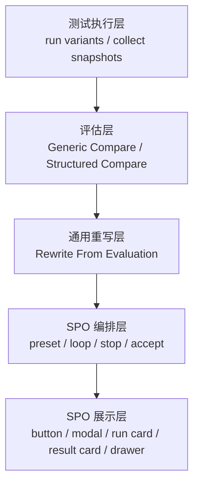
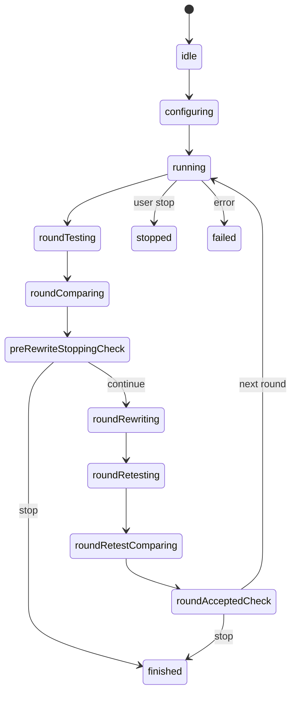

# 薄 SPO UI 与停止规则架构设计

## 1. 目标

本设计解决三个架构问题：

1. `SPO` 如何在不复制 compare intelligence 的前提下支持多轮循环
2. `SPO` 的停止条件如何尽量依赖 compare evaluation 的通用输出
3. `SPO` 的运行结果如何以最小 UI 复杂度融入现有测试区

核心目标是让 `SPO` 保持为：

- 配置层
- 编排层
- 展示层

而不是新的 judge 层。

## 1.1 当前实现状态

截至 `2026-03-20`，当前代码里与本文直接相关、已经落地的能力包括：

- `compareMode`
- `snapshotRoles`
- `compareJudgements`
- `compareStopSignals`
- `compareInsights`
- compare 角色配置弹窗与手动角色修正的稳定可用版本
- compare 手工角色在槽位语义签名变化时自动失效
- 结果面板中的 compare 元信息展示
- 结果面板中的“智能重写”按钮
- 基于压缩评估结果复用 iterate 链路的最小通用重写能力

当前仍未落地：

- `SPO` 按钮
- `SPO` 配置弹窗
- `SPO` 运行态卡片
- `SPO` 多轮状态机
- `SPO` 停止规则执行

因此本文当前主要是“目标态架构文档”，不应误读为 `SPO` 运行链路已经上线。

## 2. 分层关系



关键原则：

- compare evaluation 负责判断
- rewrite 负责改写
- SPO 负责循环与展示

## 3. 不增加 SPO 专属 LLM judge

本设计明确不建议增加一个额外的 `SPO judge` LLM 调用来决定：

- 是否继续下一轮
- 是否已经接近参考模型
- 是否改进空间很小

原因：

- 会让判断逻辑重新回到 `SPO`
- 会产生第二套难以维护的 judge 协议
- 会使 `compare evaluation` 和 `SPO` 之间再次深度耦合

推荐方式是：

- compare evaluation 输出结构化 stop signals
- `SPO` 只消费这些 signals
- 如果一轮中需要“改写后是否接受”的判断，也继续复用 compare evaluation，而不是引入第二套 judge

## 4. compare evaluation 需要补充的通用输出

在保持现有对外主结果结构不变的前提下，compare evaluation 内部或 metadata 层建议补充：

```ts
interface CompareStopSignals {
  targetVsBaseline: 'improved' | 'flat' | 'regressed'
  targetVsReferenceGap: 'none' | 'minor' | 'major'
  improvementHeadroom: 'none' | 'low' | 'medium' | 'high'
  overfitRisk: 'low' | 'medium' | 'high'
  stopRecommendation: 'continue' | 'stop' | 'review'
  stopReasons: string[]
}
```

这些字段不是 `SPO` 私有的，它们是 structured compare 的通用机器可读信号。

## 5. SPO 编排状态机

建议 `SPO` 的主状态机如下：



### 状态解释

- `configuring`
  - 用户配置目标模型、参考模型、轮次和停止策略
- `roundTesting`
  - 运行本轮 4 槽测试
- `roundComparing`
  - 对当前轮开始时的工作区执行 structured compare
- `preRewriteStoppingCheck`
  - 根据改写前 compare 的 stop signals 决定是否无需继续 rewrite
- `roundRewriting`
  - 基于 compare evaluation 结果重写 `workspace`
- `roundRetesting`
  - 对新 `workspace` 再次执行测试
- `roundRetestComparing`
  - 对复测结果再次执行 structured compare
- `roundAcceptedCheck`
  - 根据复测后的 structured compare 结果判断本轮是否接受为新的最佳轮

## 6. 停止规则架构

## 6.1 硬停止

必须直接结束：

- 达到最大轮次
- 测试失败
- compare 失败
- rewrite 失败
- stop signals 明确给出 `regressed`
- stop signals 明确给出高风险过拟合

## 6.2 软停止

满足以下情况可提前结束：

- `improvementHeadroom = none | low`
- `targetVsReferenceGap = none | minor`
- 连续多轮分数提升小于最小阈值

## 6.3 结果接受策略

每轮结束后，不应简单地“最后一轮覆盖前一轮”。

建议采用：

- 维护一个 `accepted best round`
- 新一轮只有在未回归且整体更优时才覆盖最佳轮
- 若新一轮回归，则保留上一最佳轮并停止或交由策略决定

### 6.4 accepted round 的判定来源

为保持 `SPO` 足够薄，`acceptedRound` 的判定不应由 `SPO` 自己发明文本规则，而应直接依赖“复测后的 structured compare”。

推荐做法：

1. 改写前 compare 只负责：
   - 发现问题
   - 生成 rewrite 依据
   - 给出 pre-rewrite stop 判断
2. 改写并复测后，再运行一次 structured compare。
3. `roundAcceptedCheck` 仅消费这次 post-retest compare 的结果，至少检查：
   - `targetVsBaseline` 不是 `regressed`
   - `overfitRisk` 不是 `high`
   - compare 未失败
4. 只有在满足最低安全条件后，当前轮才有资格根据 gap 收敛、summary、score 等证据覆盖上一 accepted round。

## 7. UI 架构

## 7.1 主界面最小改动

主界面只新增：

- `SPO` 按钮
- `SPO` 运行/结果卡
- 测试槽位角色 badge

不新增页面，不打断现有测试区结构。

## 7.2 详情抽屉复用现有心智模型

`SPO` 详情应采用与评估面板类似的右侧抽屉方式：

- 概览
- 轮次历史
- 单轮详情
- 停止原因

这样避免引入新的复杂导航结构。

## 7.3 最终结果展示原则

结果展示必须区分：

- 最后执行轮
- 最终采用轮

否则多轮过程中一旦后续轮回归，用户很难理解系统最终保留了什么。

## 8. 建议的数据模型

```ts
interface SpoConfig {
  targetModelKey: string
  referenceModelKey: string
  maxRounds: number
  stopMode: 'round-only' | 'smart' | 'custom'
  rewriteModelKey?: string
}

interface SpoRuntimeState {
  status: 'idle' | 'running' | 'completed' | 'stopped' | 'failed'
  currentRound: number
  acceptedRound: number | null
  bestScore: number | null
  stopReason?: string
  rounds: SpoRoundState[]
}

interface SpoRoundState {
  round: number
  compareScore: number | null
  accepted: boolean
  stopSignals?: CompareStopSignals
  acceptanceSignals?: CompareStopSignals
  summary?: string
}
```

其中：

- `SpoConfig` 属于 `SPO`
- `CompareStopSignals` 属于 compare evaluation

## 9. 推荐实现顺序

### 阶段 1

- compare evaluation 增加 stop signals
- 结果面板逐步支持机器可读信号

### 阶段 2

- `SPO` 配置弹窗
- `SPO` 运行卡 / 结果卡
- `SPO` 详情抽屉

### 阶段 3

- 多轮 loop
- smart stop
- best round accept policy

## 10. 结论

最合理的架构是：

- compare evaluation 输出通用 stop signals
- rewrite 继续作为通用能力
- `SPO` 保持为极薄的 loop controller + UI wrapper

这样可以最大限度复用现有能力，同时把“为什么停、停在哪一轮、最终保留哪一轮”清晰呈现给用户。
