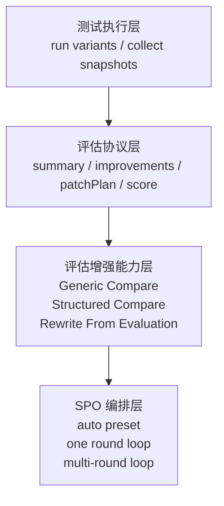

# Structured Compare 与评估结果驱动重写架构设计

## 1. 目标

本设计解决两个架构问题：

1. compare evaluation 如何在不依赖 `SPO` 的前提下支持更强的结构化判断
2. “根据评估结果自动重写 prompt”如何作为通用能力服务于所有评估面板

最终目标是形成三层架构：

- 评估协议层
- 评估增强能力层
- SPO 编排层

## 1.1 当前实现状态

本文同时描述“已经落地的当前实现”和“目标态架构”。

截至 `2026-03-20`，当前已落地：

- `CompareAnalysisHints.mode`
- `CompareAnalysisHints.snapshotRoles`
- 前端在可形成 judge plan 时自动推断 structured compare 角色
- `Structured Compare = pairwise judge + synthesis`
- pairwise judge 并发执行
- compare 结果中的：
  - `metadata.compareMode`
  - `metadata.snapshotRoles`
  - `metadata.compareJudgements`
  - `metadata.compareStopSignals`
  - `metadata.compareInsights`
    - `pairHighlights`
    - `evidenceHighlights`
    - `learnableSignals`
    - `overfitWarnings`
    - `progressSummary / referenceGapSummary / promptChangeSummary / stabilitySummary`
    - `conflictSignals`
- 结果面板对 compare 元信息、pairwise judgements、conflict checks 与 stop signals 的展示
- `Rewrite From Evaluation` 的增强通用能力：
  - 结果面板新增“智能重写”按钮
  - 复用现有 iterate 模板与版本链路
  - 输入只消费压缩后的 `summary / improvements / patchPlan / compareInsights / compareStopSignals / conflictSignals`
  - 会进一步做去重、分层和 compare 结果压缩，形成更稳定的 rewrite brief
  - 当前先落在文本工作区
- compare 配置的稳定可用交互：
  - 测试区可打开 compare 角色配置弹窗
  - 可查看自动推断角色
  - 可手动修正角色并持久化到 session
  - 多个 `workspace` 槽位时必须显式选择 `target`
  - 手工指定 `target` 后自动补全其余角色
  - 自动推断会收敛为单一 `baseline / reference / referenceBaseline`，其余多余候选降级为 `auxiliary`
  - 当槽位语义签名变化时，旧的手工角色会自动失效
  - 当前槽位语义签名已覆盖 `promptRef kind/version`、`modelKey` 与 `non-workspace` 槽位的 prompt 文本签名
  - `workspace` 槽位的 prompt 文本变化不会直接清空手工角色，而是进入“待复核”状态
  - compare 真正执行前若存在待复核角色，会打开弹窗要求重新确认
  - 可查看手动 / 自动 / 已失效旧配置的来源状态
  - 可预览当前会进入 `structured` 还是 `generic`
  - 可预览当前可执行的核心 pairwise judge
  - 会拦截多个 `target / baseline / reference / referenceBaseline` 这类会导致 structured compare 歧义的配置
  - compare 结果元数据在 UI 侧已抽成共享消费模块，统一供结果面板、评估状态与智能重写消费

当前未落地：

- 更强的 `Rewrite From Evaluation` 协议与独立模板

## 2. 分层架构



关键原则：

- `SPO` 不能直接发明新的 compare 协议
- `Structured Compare` 属于 compare evaluation 的增强模式
- `Rewrite From Evaluation` 属于通用重写能力，不应只服务于自动优化

## 3. 当前协议基础

现有 compare evaluation 输出协议已经稳定：

- `summary`
- `improvements`
- `patchPlan`
- `score`

因此本期不建议改动最终外部返回结构，而是优先增强 compare 的内部生成方式。

## 4. Compare 的两种模式

## 4.1 Generic Compare

输入特征：

- 任意数量 `snapshots`
- 无明确 target 语义
- 无结构化角色配置

当前执行方式：

- 复用当前 compare evaluation 逻辑

适用：

- 普通 compare
- 任意自由组合测试

## 4.2 Structured Compare

输入特征：

- 至少有一个 `target`
- 其他快照被自动推断或手动标记角色

执行方式：

1. 角色校验
2. 生成 pairwise judge plan
3. 执行 blind pairwise judge
4. 执行 synthesis
5. 输出现有 compare 协议

适用：

- target-centered compare
- auto iterate judge

补充说明：

- 当前代码已落地的是“真实 structured compare 内核”
- 当前 structured compare 实现是：
  - 角色 hints 注入
  - judge plan 生成
  - 多个 blind pairwise judge 并发执行
  - 独立 synthesis
  - 输出 `compareMode / snapshotRoles / compareJudgements / compareStopSignals / compareInsights`
- 当前还未落地的是：
  - 更细粒度的角色推断启发式与更丰富的 judge plan 组合

## 5. 结构化角色模型

建议在 compare 输入 hints 中扩展出一组中性角色，而不是硬编码 `reference` 这类业务词：

- `target`
- `baseline`
- `reference`
- `referenceBaseline`
- `replica`
- `auxiliary`

### 为什么使用中性角色

- compare evaluation 可复用
- SPO 只是其中一个角色绑定来源
- 用户手工 compare 也可以进入 structured mode

## 6. Compare 输入扩展建议

当前 `CompareAnalysisHints` 已经扩展为：

```ts
interface StructuredCompareHints {
  mode?: 'generic' | 'structured'
  snapshotRoles?: Record<
    string,
    'target' | 'baseline' | 'reference' | 'referenceBaseline' | 'replica' | 'auxiliary'
  >
}
```

当前实现策略：

- 未提供 `mode` 或 `snapshotRoles` 时，走 `generic`
- 当前前端只会在可形成 judge plan 时自动推断并启用 `structured`
- 当前最小可用 judge plan 要求至少存在 `target`，并且至少有 `baseline / reference / replica` 之一
- 若只有一个 `workspace` 槽位，可自动视为 `target`
- 若有多个 `workspace` 槽位，必须由用户显式指定 `target`
- 在 `target` 确定后，自动推断只会收敛出单一 `baseline / reference / referenceBaseline`
- 其余未进入核心 judge 的候选会被降级为 `auxiliary`

目标态建议仍然是：

- 只有角色信息足够稳定时，才启用更强的 structured compare
- 把角色选择 / 修正能力上移到 compare 配置层

这样可以避免 compare evaluation 直接依赖 `SPO` 配置对象。

## 7. Pairwise Judge Plan 生成

Structured Compare 内部应根据角色生成 judge plan，而不是固定写死 A/B/C/D。

### 核心 judge

1. `target` vs `baseline`
2. `target` vs `reference`
3. `reference` vs `referenceBaseline`

### 可选 judge

4. `target` vs `replica`

### 非核心角色

- `auxiliary` 只进入 synthesis，不进入核心 blind judge
- `reference` vs `replica` 目前仍属于潜在扩展项，当前实现尚未纳入 judge plan

## 8. Rewrite From Evaluation

## 8.1 设计要求

新增通用能力：

- 输入：评估结果 + 当前工作区 prompt + 可选最小证据锚点
- 输出：新的工作区 prompt 草稿

这个能力应可服务于：

- prompt-only
- result
- compare
- focus evaluation

## 8.2 能力边界

该能力应负责：

- 总结整份评估结果
- 过滤样例特化建议
- 保留原 prompt 硬约束
- 生成新的 prompt 文本

该能力不负责：

- 自动运行 compare
- 自动复测
- 自动多轮循环

这些仍属于 `SPO` 编排层。

## 8.3 Stop Signals From Compare

为了支持 `SPO` 等自动化上层，而不把停止判断重新塞回 `SPO`，建议 compare evaluation 在内部增强中补充一组机器可读的 stop signals。

建议形式：

```ts
interface CompareStopSignals {
  targetVsBaseline: 'improved' | 'flat' | 'regressed'
  targetVsReferenceGap: 'none' | 'minor' | 'major'
  improvementHeadroom: 'none' | 'low' | 'medium' | 'high'
  overfitRisk: 'low' | 'medium' | 'high'
  stopRecommendation: 'continue' | 'stop' | 'review'
  stopReasons: string[]
}
```

这组结构的作用是：

- 让 `SPO` 可以直接消费 compare judgement 与 stop signals
- 避免新增 `SPO` 专属 judge LLM 调用
- 让 compare evaluation 的判断结果可复用于更多自动化功能

同时当前实现还补充了一组 `compareInsights.conflictSignals`：

```ts
type CompareConflictSignal =
  | 'improvementNotSupportedOnReference'
  | 'improvementUnstableAcrossReplicas'
  | 'regressionOutweighsCosmeticGains'
  | 'sampleOverfitRiskVisible'
```

这组结构的作用是：

- 把 pairwise judge 派生出的冲突检查结果 machine-readable 化
- 避免 UI、rewrite、未来 SPO 去解析 synthesis 自然语言
- 让“继续改”“先复核”“警惕样例过拟合”这些动作建议有更稳定的底座

## 9. UI / 交互架构

## 9.1 Compare 配置弹窗

职责：

- 选择 target
- 展示自动推断角色
- 允许少量人工修正
- 预览当前会进入 `structured` 还是 `generic`
- 预览当前可执行的核心 pairwise judge
- 阻止会导致 structured compare 歧义的单例角色冲突

输出：

- compare 角色配置

该配置应存放在测试区 session 中，而不是 SPO 专属状态中。

## 9.2 结果面板动作

结果面板建议统一支持三类动作：

- `立即替换`
- `迭代优化`
- `智能重写`

其中：

- `立即替换` 对应 `patchPlan`
- `迭代优化` 对应单条 `improvement`
- `智能重写` 对应整份 `evaluation result`

## 10. SPO 的职责边界

SPO 只应负责：

- 自动预置测试槽位
- 自动生成 compare 角色配置
- 串联：
  - test
  - compare
  - rewrite
  - retest
  - post-retest compare
- 管理轮次、停止条件、接受条件
- 管理运行态 UI

SPO 不应负责：

- 定义 compare 返回结构
- 定义 compare 的 blind judge 协议
- 定义 rewrite from evaluation 的通用协议
- 定义 stop signals 的 judge 逻辑

## 11. 推荐实现顺序

### 阶段 1

- compare hints 的结构化扩展
- `metadata.compareStopSignals`
- compare 结果消费侧透传

状态：已完成

### 阶段 2

- structured compare 内核
- `metadata.compareJudgements`
- stop signals / judge results 的基础展示

状态：已完成

- structured compare 已切换为 pairwise judge + synthesis
- pairwise judge 已改为并发执行
- judge 结果已透传到 compare metadata
- 结果面板基础展示已完成

### 阶段 3

- compare 配置弹窗
- role inference
- `Rewrite From Evaluation`

状态：部分完成

- role inference 已有自动推断
- compare 配置弹窗与人工角色修正已进入稳定可用版本
- 多个 `workspace` 槽位时必须显式选择 `target` 已落地
- 手工指定 `target` 后自动补全其余角色已落地
- 自动收敛为单一 `baseline / reference / referenceBaseline` 已落地，剩余候选会降级为 `auxiliary`
- 当 `promptRef kind/version + modelKey` 变化时，手工角色失效保护已落地
- `non-workspace` 槽位的 prompt 文本变化级别失效保护已落地
- `workspace` 槽位的 prompt 变化复核机制已落地：
  - 不再静默清空手工角色
  - compare 执行前会强制重新确认
- compare 配置中的 structured / generic 预览、pair 预览与单例角色冲突拦截已落地
- compare insights 中的 `conflictSignals` 与结果面板中的 `conflict checks` 已落地
- 通用 `Rewrite From Evaluation` 已有最小实现：
  - 由结果面板直接触发
  - 复用 iterate 流程自动形成新版本
  - 当前已不再是简单平铺字段，而是会把评估结果压缩成更结构化的 rewrite brief
  - 当前已显式纳入 `compareStopSignals + compareInsights + conflictSignals`
  - 但仍未独立成单独模板协议层

### 阶段 4

- `SPO` 按钮 / 配置弹窗 / 运行卡 / 结果卡 / 抽屉

### 阶段 5

- `SPO` 预置 structured compare
- 自动一轮 / 多轮
- stop rule / accept rule

## 12. 结论

架构上最合理的方向是：

- compare evaluation 内部增强为 `Generic + Structured`
- rewrite 能力提升为“评估结果驱动的通用智能重写”
- SPO 只在最上层做 orchestration

这样可以最大化复用 compare 与 rewrite 能力，同时将自动优化逻辑控制在最薄的一层。
