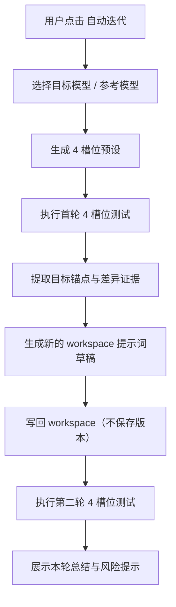

# 测试区自动迭代一轮

> 说明：本文记录的是最初的一轮自动迭代方案。
> 最新设计已经进一步拆分为：
> - `docs/architecture/structured-compare-and-evaluation-rewrite.md`
> - `docs/architecture/spo-thin-loop-ui-and-stop-rules.md`
>
> 因此，本文更适合作为“问题背景与早期方案说明”阅读，而不是当前唯一的实施规范。

## 1. 背景

我们已经在 `basic-system` 中拥有较完整的多槽位测试能力：

- 测试区支持 `2 / 3 / 4` 列
- 每列可独立选择 `version + model`
- 可统一执行 `runAllVariants`
- 对比评估链路支持基于多 `snapshot` 的证据分析
- system 模式天然具备独立的测试输入区，适合作为“固定执行场景”来验证系统提示词

因此，本期不再设计一个新的 SPO 实验台，而是把“朝目标自动迭代”的能力嵌入现有测试区。

这也更符合 prompt-optimizer 的定位：

- 优化必须建立在真实执行结果之上
- 测试、评估、改写应形成闭环
- 用户应继续围绕当前工作区进行操作，而不是切换到另一个体系

## 2. 目标

在测试区中新增一个“自动迭代”配置入口。用户只需选择：

- `目标模型`
- `参考模型`

系统就自动完成：

1. 构造 4 槽位测试预设
2. 执行一次上一版本对照测试
3. 提取目标锚点与差异证据
4. 改写当前 `workspace` 提示词
5. 再执行一次测试
6. 向用户展示本轮结果与风险提示

## 3. 设计原则

- 复用优先：尽量复用现有测试区、多槽位、对比评估与工作区写回能力
- 单轮优先：V1 只做一轮，先验证闭环是否可靠
- 目标明确：始终围绕 `目标模型 / workspace` 做优化
- 参考充分：同时利用参考模型与上一版本，避免单点偏置
- 护栏先行：禁止只追求当前样例更优而破坏提示词通用性
- 输入隔离：测试输入只用于验证系统提示词行为，不应沉淀为系统规则

## 4. 范围与非目标

### 4.1 本期范围

- `basic-system`
- 测试区顶部新增自动迭代入口
- 自动生成 4 槽位预设
- 一次自动迭代闭环
- 将改写结果写回 `workspace` 草稿
- 不自动保存为新历史版本
- 优化对象限定为系统提示词

### 4.2 非目标

- 多轮无人值守自动优化
- 新建 SPO 独立页面
- 用户手工编排任意复杂实验图
- 脱离真实执行结果、仅靠目标描述进行优化

## 5. 为什么系统“知道目标是什么”

本设计不引入额外的“目标说明”表单，而是将目标识别收敛为一个结构化锚点提取过程。

目标由以下信息联合确定：

1. `目标槽位`
   - 用户显式选择 `目标模型`
   - 系统将 `目标模型 / workspace` 视为唯一待优化对象
2. `当前提示词中的显式约束`
   - 系统角色设定
   - 任务边界
   - 输出格式
   - 禁止事项
   - 质量要求
3. `上一版本参考`
   - `目标模型 / 上一版本`
   - `参考模型 / 上一版本`
   - 用来识别已有能力与不可退化项
4. `参考模型差异`
   - `参考模型 / workspace` 相对 `目标模型 / workspace` 的优势表现
   - 用来识别当前提示词在目标模型上的表达盲点

因此，“目标”不是一个额外配置文本，而是：

`目标模型 + 当前系统提示词 + 上一版本参考 + 跨模型差异证据`

这比抽象目标更贴近真实使用场景，也更适合结合我们现有测试功能。

## 6. UX 交互

### 6.1 入口位置

在测试区顶部操作栏中，新增一个与“运行全部”并列的按钮：

- `自动迭代`

该按钮位于当前测试区上下文中，避免用户切换心智模型。

### 6.2 配置弹窗

点击后弹出配置弹窗，V1 保持最小可用，仅包含：

- `目标模型`
- `参考模型`

弹窗辅助说明：

- 本轮会自动生成 4 槽位预设
- 本轮只改写 `workspace`
- 改写后会自动复测
- 不会自动保存版本

弹窗主按钮建议文案：

- `生成预设并执行一轮`

### 6.3 结果反馈

一轮结束后，用户在原测试区看到新的 4 槽位结果。

同时提供一个轻量的“本轮总结”区域，至少包含：

- 学到了什么
- 改了什么
- 为什么这样改
- 潜在风险
- 是否建议保存为新版本

V1 不要求新建复杂历史面板；保持轻量即可。

## 7. 四槽位预设规则

自动迭代使用固定的 4 槽位语义：

| 槽位 | 模型 | 版本 | 角色 |
| --- | --- | --- | --- |
| A | 目标模型 | `workspace` | 主优化对象 |
| B | 目标模型 | `previous version` | 目标模型上一版本参考 |
| C | 参考模型 | `workspace` | 参考对照 |
| D | 参考模型 | `previous version` | 参考模型上一版本参考 |

### 7.1 上一版本定义

“上一版本（previous version）”指当前工作区在本轮自动改写之前的最近一次稳定版本：

- 如果工作区基于当前历史链最新版本继续编辑，则 `previous = 当前链最新版本`
- 如果当前没有历史链，则回退为 `v0`

这里刻意不用 `v-last`，因为它很容易让人误解成“最新版本”；也不用“基线版本”，因为“基线”更像不变参照。本设计真正想表达的是“当前轮次之前的那个版本”。

如果后续要加入一个不随自动迭代轮次变化的固定对照，再单独引入“固定基线”概念。

### 7.2 为什么是这 4 个槽位

这 4 个槽位同时提供三条证据线：

1. `A vs B`
   - 当前工作区在目标模型上，相比上一版本是否真的更好
2. `A vs C`
   - 同一提示词在目标模型与参考模型上的差异，目标模型还缺什么
3. `C vs D`
   - 参考模型在当前工作区上是否也体现出增益，帮助判断改进是否具有结构性

## 8. 一轮自动迭代编排

### 8.1 主流程

### 8.2 详细步骤

1. 校验前置条件
   - 当前有可执行的测试输入
   - 已配置目标模型与参考模型
   - 工作区提示词非空
   - 当前模式为 `basic-system`
2. 应用 4 槽位预设
   - 设置列数为 4
   - 覆盖对应槽位的 `version + model`
3. 执行首轮测试
   - 复用 `runAllVariants`
   - 产出 4 份执行快照
4. 构造自动迭代上下文包
   - 见第 9 节
5. 调用自动改写链路
   - 生成新的 `workspace` 提示词草稿
6. 写回工作区
   - 更新当前 `workspace`
   - 不生成新版本记录
7. 执行第二轮测试
   - 再次运行 4 个槽位
8. 展示结果
   - 输出本轮学习点、改动摘要、回归风险、是否建议采纳

## 9. 自动迭代的模型上下文构造

这是本功能设计的核心。

我们不直接把“4 个输出文本”粗暴拼接给模型，而是构造一个面向自动改写的上下文包。

### 9.1 输入结构

建议组织为以下几组信息：

1. 任务元信息
   - mode: `basic-system`
   - round: `1`
   - targetModelKey
   - referenceModelKey
   - targetVariantId: `A`
2. 提示词上下文
   - currentWorkspaceSystemPrompt
   - previousVersionSystemPrompt
   - originalPrompt (`v0`，可选)
3. 测试用例上下文
   - 当前测试输入
   - 用例标签
   - 设置摘要
   - 标注其角色为“执行场景”，而不是“可上升为系统规则的规范来源”
4. 执行快照
   - A/B/C/D 各自的：
     - version
     - model
     - prompt
     - output
     - reasoning
5. 差异分析输入
   - A 相比 B 的提升与退化
   - A 相比 C 的缺口
   - C 相比 D 的参考侧新增能力
6. 约束与护栏
   - 只改写 `workspace`
   - 保留现有硬约束
   - 不接受样例特化规则
   - 证据不足时允许返回 no-op

### 9.2 目标锚点提取

在真正改写前，系统应先基于上述上下文提取一组“目标锚点”：

- 硬锚点
  - 直接来自提示词文本中的强约束
- 稳定锚点
  - 在上一版本中已经存在且不应退化的能力
- 机会锚点
  - 参考模型在同一提示词下能做到，但目标模型当前没有稳定做到的点
- 负锚点
  - 来自当前测试输入、可能诱导过拟合的具体词面规则

只有在锚点提取完成后，才进入提示词改写步骤。

### 9.3 输出要求

自动改写链路至少要返回：

- `nextWorkspacePrompt`
- `learnedAnchors`
- `appliedChanges`
- `rejectedOverfitIdeas`
- `riskNotes`

这样后续 UI 才能向用户解释“为什么改”，而不是只给出一个新提示词。

## 10. 防过拟合与回归保护

### 10.1 成功判定

不能只看“当前测试样例是否更好”，至少要同时满足：

1. `目标模型 / workspace` 相比 `目标模型 / 上一版本` 有明确改进，或至少无关键能力退化
2. `参考模型 / workspace` 不应相对 `参考模型 / 上一版本` 明显退化
3. 改动理由能抽象为结构性规则，而不是当前输入样例的字面补丁

对 `basic-system` 来说，这里的“结构性规则”通常表现为：

- 角色边界更清晰
- 优先级更明确
- 失败处理更稳定
- 输出约束更一致
- 冲突指令的裁决顺序更清楚

### 10.2 拒绝改写的情况

以下情况应允许系统返回“本轮不建议改写”：

- 四槽位证据差异不显著
- 目标与参考差异主要来自采样波动而不是结构问题
- 改进建议高度依赖当前测试输入中的具体值
- 改写会破坏提示词中已有的强约束

## 11. 与现有能力的衔接

### 11.1 复用现有多槽位测试区

无需重做测试区主体结构，直接使用：

- `testColumnCount`
- `testVariants`
- `runAllVariants`
- per-slot `version + model` 选择

### 11.2 复用 compare-evaluation 证据结构

现有 `compareEvaluation.ts` 已经采用：

- `testCases`
- `snapshots`
- `compareHints`

组织执行证据。

本功能可以直接复用这一思路，避免重新发明多快照比较协议。

### 11.3 复用现有工作区改写能力

自动迭代的最终落点仍然是更新 `workspace` 草稿。

也就是说：

- 它不是新增一套独立提示词存储
- 它不是单独的实验输出
- 它最终仍然服务于当前工作区编辑与后续人工保存

## 12. 建议的实现触点

- `packages/ui/src/components/basic-mode/BasicSystemWorkspace.vue`
  - 自动迭代按钮
  - 配置弹窗
  - 本轮总结 UI
- `packages/ui/src/stores/session/useBasicSystemSession.ts`
  - 自动迭代配置持久化
  - 可能的最近一次执行摘要
- `packages/ui/src/composables/prompt/compareEvaluation.ts`
  - 复用 snapshot 组织模式
- 新增编排文件（建议）
  - `packages/ui/src/composables/prompt/autoIterateOneRound.ts`
  - `packages/ui/src/composables/prompt/autoIteratePreset.ts`

## 13. V1 验收标准

- 测试区可直接打开自动迭代配置弹窗
- 用户只配置 `目标模型` 与 `参考模型`
- 系统自动生成 4 槽位预设并执行
- 自动迭代只修改系统提示词的 `workspace`
- 改写后自动复测
- UI 能展示本轮学习点、改动点、风险点
- 系统允许在证据不足时选择“不改”
- 系统不会把测试输入里的具体值直接固化进系统提示词

## 14. 后续演进

V1 跑通后，可逐步扩展：

- 支持 3 槽位简化模式
- 支持多轮自动迭代
- 引入更强的“目标锚点提取”显式展示
- 支持把一轮总结沉淀为版本注释或评审记录
