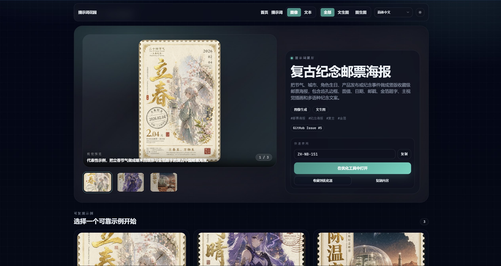
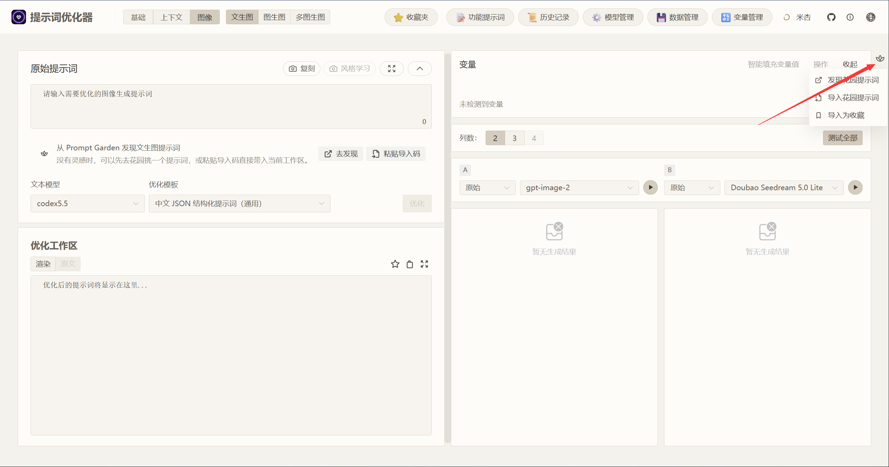
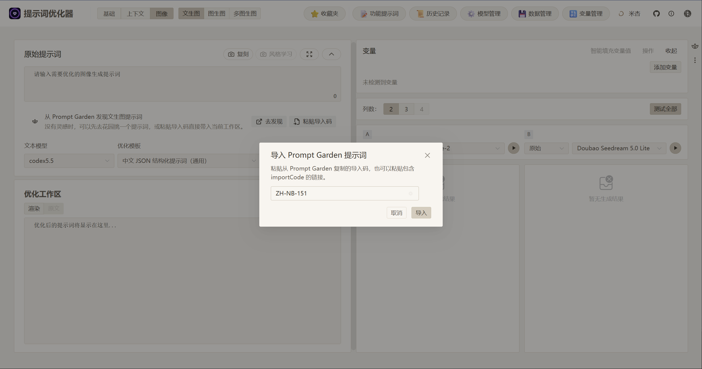
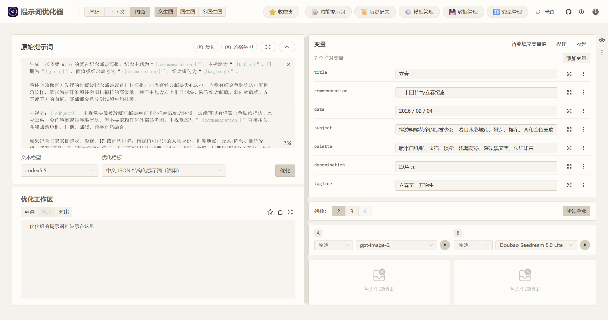
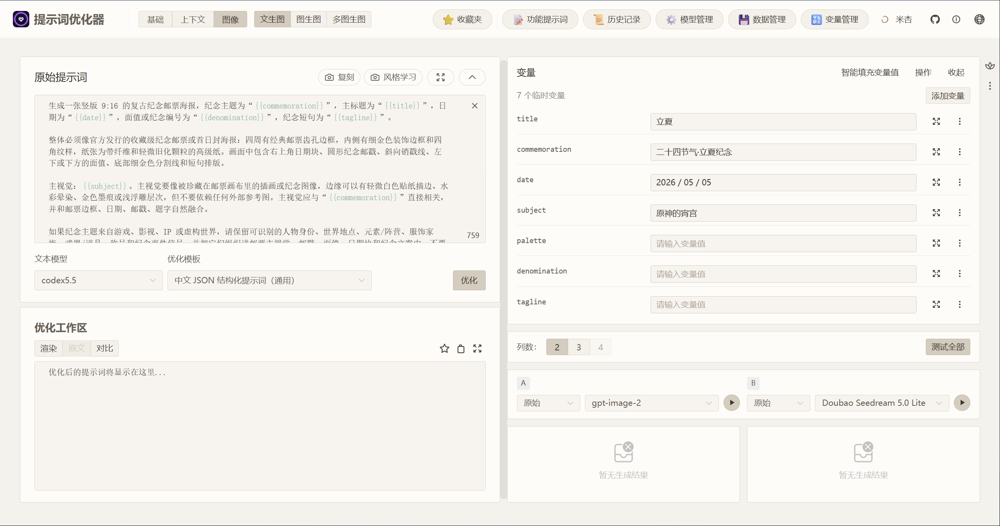
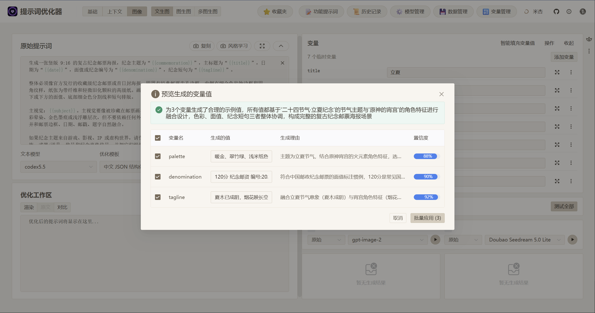
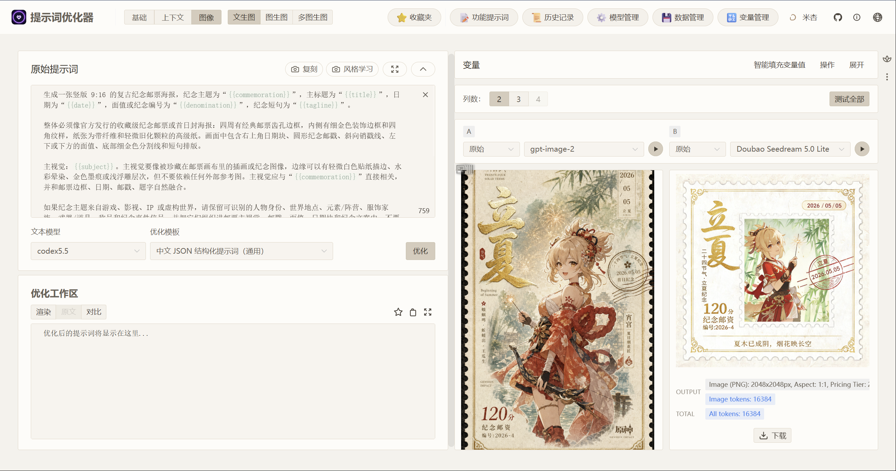
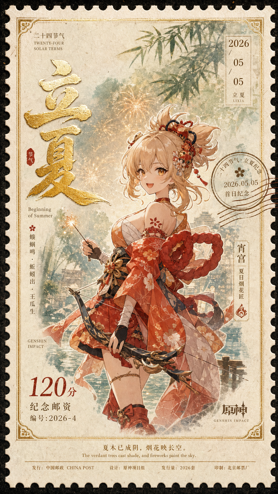

# Import an Image Prompt from the Prompt Library and Compare Models

This example walks through a complete image prompt workflow: choose a reusable template from the prompt library, import it into Optimizer, edit a few core variables, use smart variable fill for the remaining fields, and compare outputs from two image models.

The example uses the [vintage commemorative postage stamp poster](https://garden.always200.com/prompts/vintage-commemorative-postage-stamp-poster) prompt from the prompt library. Its import code is `ZH-NB-151`.

## 1. Choose a Template in the Prompt Library

Open the prompt detail page and review the prompt description, sample images, and import code. This template is designed to turn solar terms, cities, character birthdays, product launches, or commemorative events into vertical collectible postage stamp posters.

There are two entry points on the prompt page:

- Click "Open in Optimizer" to jump directly to the Optimizer web interface.
- Copy the import code `ZH-NB-151` and import it manually in Optimizer later.

## 2. Import It into Optimizer

Open Optimizer's text-to-image workspace. If you did not jump directly from the prompt library page, click the flower icon in the right toolbar and choose the Prompt Garden import action.

Paste the import code `ZH-NB-151` into the dialog and click Import.

After import, Optimizer keeps the template body and detects 7 variables: `title`, `commemoration`, `date`, `subject`, `palette`, `denomination`, and `tagline`. The sample values from the template are also imported, so you can edit them directly.

## 3. Edit the Core Variables

You can edit variables one by one. In this example, the stamp poster structure stays the same, while the core theme changes to Beginning of Summer and Yoimiya from Genshin Impact:

| Variable | Example value |
| --- | --- |
| `title` | 立夏 |
| `commemoration` | 二十四节气·立夏纪念 |
| `date` | 2026 / 05 / 05 |
| `subject` | 原神的宵宫 |

The remaining variables can be filled manually, or left empty and completed with smart variable fill.

## 4. Complete Details with Smart Fill

Click Smart Variable Fill. Optimizer generates values for the remaining fields from the existing variables. The confirmation dialog shows the generated values, reasons, and confidence scores, so you can apply only the suggestions you want.

In this run, smart fill completed the palette, denomination, and tagline so they matched the Beginning of Summer and Yoimiya theme.

After applying the suggestions, you can still adjust the values. The final generation used:

| Variable | Example value |
| --- | --- |
| `palette` | 暖金、翠竹绿、浅米纸色 |
| `denomination` | 120分 纪念邮资 编号:2026-4 |
| `tagline` | 夏木已成阴，烟花映长空 |

## 5. Select Models and Generate a Comparison

After confirming the variables, choose the image models in the test area. In this example:

- Column A: `gpt-image-2`
- Column B: `Doubao Seedream 5.0 Lite`

Generate both columns to compare how the models interpret the same prompt. Column A is closer to a complete vintage postage stamp poster, with more stable perforations, postmark, denomination, date block, and title hierarchy. Column B looks more like a bright character illustration card: lighter and cleaner, but less like a collectible poster.

## 6. Review the Final Result

If one result is closer to the target, download it or continue refining the variables around that direction. Below is the final `gpt-image-2` result from this run.

## What This Example Validates

- Whether a prompt library template imports smoothly into the text-to-image workspace.
- Whether the variable structure is preserved and can be edited directly or completed with smart fill.
- How different image models handle layout, text, subject identity, and detail from the same prompt.
- Whether the image prompt keeps the output aligned with a vintage commemorative postage stamp poster.

## Related Pages

- [Text-to-Image Workspace](../image/text2image-workspace.md)
- [Smart Variable Fill](../auxiliary/smart-fill.md)
- [Prompt Library](../basic/prompt-garden.md)
- [Model Testing Strategy](../user/model-testing-strategy.md)
